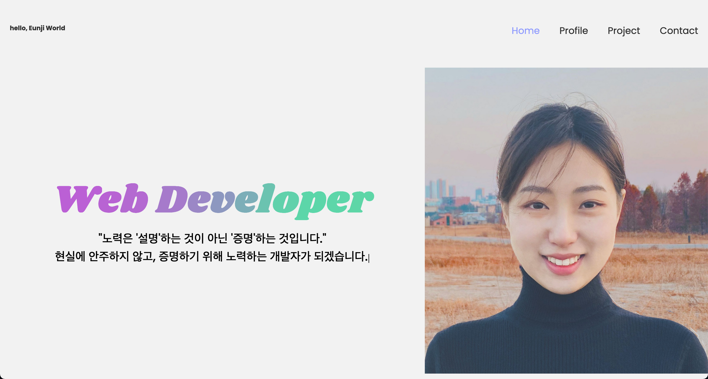

# 2021ver. PORTFOLIO

HTML5/CSS3/Javascript로 구현한 포트폴리오 사이트입니다.

## Awards

 
노마드코더 SHOWME PORTFOLIO - 코린이상 감사합니다!!!  
👉 [참가 내용](https://nomadcoders.co/community/thread/565)

서비스 소개:

디자인에 자신이 없어 최대한 간단하고 깔끔하게 표현하고 싶었습니다. HTML CSS로 만들고, 상단메뉴를 클릭했을 때 해당 페이지가 자연스럽게 나타나도록 javascript로 구현해 보았습니다. emailJS 로 페이지 내에서 메일전송을 할 수 있게 해보았습니다.

개발 과정:

포트폴리오의 완성도를 높이고 싶어 크로스브라우징을 통해 IE에서도 잘 동작하기만을 바랐지만.. skills 아이콘들의 배열을 도저히 바꿀 수 가 없어 포기하고 말았습니다..^^ 가지고 있는 기술들을 최대한 보여주고 싶었지만, 제 맘처럼 되지 않아 빼고 빼고 또 빼다 보니 단순하다 못해 단촐한 디자인이 나와버린 것이 조금 아쉽습니다😢

앞으로 계획:

포트폴리오를 제작하면서 또 다른분들의 포트폴리오 사이트를 보면서 정말 부족한 제자신을 느꼈고ㅠㅠ좋은 자극도 받을 수 있었습니다.

현재 진행중인 위튜브, 리액트 프로젝트를 끝내고 나면, 그 기술을 기반으로 한 더 만족스러운 포트폴리오를 만들어 보고 싶습니다. 끝으로 제 포트폴리오를 봐주셔서 감사합니다^^

## Preview

## Go to page

👉 <https://eunjitech.github.io/>

## Pages

- [x] Home

- [x] Profile

- [x] Project

- [x] Contact
